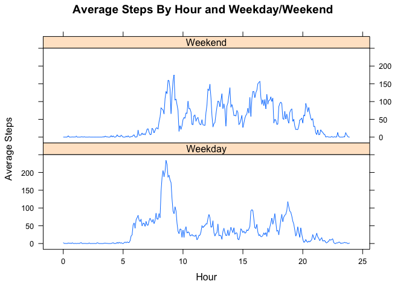

# Reproducible Research: Peer Assessment 1


## Loading and preprocessing the data

```r
## Load the data
setwd("/Users/Owner/Desktop/Coursera/RepData/RepData_PeerAssessment1")
activity <- read.csv("activity.csv")

## Create a new variable fracHour, which transforms interval, which counts
## seconds (0, 5, ..., 55), into fractions of an hour (0, 0.0833, ...,0.9167)
activity$fracHour <- with(activity, 
     round(100*(interval %/% 100) + (interval %% 100) * (100 / 60) , 2) / 100)
head(activity,12)
```

```
##    steps       date interval fracHour
## 1     NA 2012-10-01        0   0.0000
## 2     NA 2012-10-01        5   0.0833
## 3     NA 2012-10-01       10   0.1667
## 4     NA 2012-10-01       15   0.2500
## 5     NA 2012-10-01       20   0.3333
## 6     NA 2012-10-01       25   0.4167
## 7     NA 2012-10-01       30   0.5000
## 8     NA 2012-10-01       35   0.5833
## 9     NA 2012-10-01       40   0.6667
## 10    NA 2012-10-01       45   0.7500
## 11    NA 2012-10-01       50   0.8333
## 12    NA 2012-10-01       55   0.9167
```

## Define a function for some repeated tasks

```r
## For a data frame like activity, compute the total steps taken per day,
## create a histogram thereof, and compute mean and median thereof
summByDay <- function(data) {
        totalStepsByDay <- aggregate(steps ~ date, data=data, FUN=sum,
                                     na.action = na.omit)
        
        with(totalStepsByDay, hist(steps,main="Histogram of Steps Per Day",
                                   xlab="Steps"))
        
        with(totalStepsByDay, c(mean=mean(steps),median=median(steps)))    
}
```

## What is the mean total number of steps taken per day?

```r
summByDay(activity)
```

 

```
##   mean median 
##  10766  10765
```


## What is the average daily activity pattern? 

```r
avgStepsByInt <- aggregate(steps ~ fracHour, data=activity, FUN=mean,
                           na.action = na.omit)
```


#### Time series of average steps by interval

```r
with(avgStepsByInt, plot(fracHour,steps,type="l",xlab="Hour",
                         ylab="Average Steps",
                         main="Average Steps By Hour"), )
```

 

#### Interval and fractional hour with maximum average number of steps

```r
maxint <- activity$interval[which.max(avgStepsByInt$steps)]
maxhour <- activity$fracHour[which.max(avgStepsByInt$steps)]
c(Interval=maxint, Fractional_Hour=maxhour)
```

```
##        Interval Fractional_Hour 
##         835.000           8.583
```


## Imputing missing values
####Impute missing values with means by interval over nonmissing data.

```r
naInd <- is.na(activity$steps)  # Where are missing values?
actimput <- activity            # New data frame for imputed steps
actimput$steps[naInd] <-        # Impute missing values with interval means
        avgStepsByInt$steps[match(actimput$fracHour[naInd],
                                  avgStepsByInt$fracHour)]
```

#### Repeat summaries of steps by hour for imputed steps

```r
summByDay(actimput)
```

 

```
##   mean median 
##  10766  10766
```

Note that imputing missing values with means by interval only adds more 
observations to the center of the distribution of steps by day. So, in the
histogram the central bar gets higher, and the measures of central tendency
are not changed at all (mean) or only slightly changed (median).

## Are there differences in activity patterns between weekdays and weekends?

```r
activity$dayOfWeek <- with(activity,weekdays(as.Date(date)))

weekDays <- c("Monday","Tuesday","Wednesday","Thursday","Friday")

activity$typeOfDay <- with(activity,
        factor(ifelse(dayOfWeek %in% weekDays,"Weekday","Weekend")))

avgStepsByInt2 <- aggregate(steps ~ fracHour + typeOfDay, data=activity,
                            FUN=mean, na.action=na.omit)

library(lattice)

xyplot(steps ~ fracHour | typeOfDay, data=avgStepsByInt2, type='l',
       xlab="Hour", ylab="Average Steps",
       main="Average Steps By Hour and Weekday/Weekend",
       layout=c(1,2))
```

 
